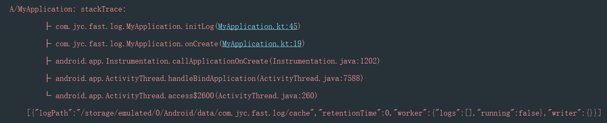
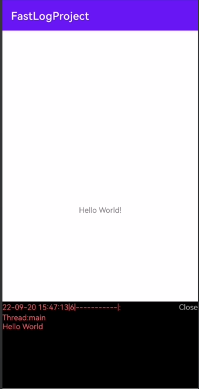

#### FastLogPlugin
一款高扩展的日志组件FastLogPlugin

* 支持控制台堆栈信息打印
* 支持任何数据类型的打印



* 支持实现真机日志可视化



* 支持真机文件打印
* 支持打印器的插板，方便扩展

#### 快速使用

1. build.gradle文件中添加如下依赖

```shell
dependencies {
	implementation 'io.github.mrjiangdong:FastLogPlugin:1.0.0'
}
```

2.在你的Application文件中初始化

```kotlin
private fun initLog() {
        FastLogManager.init(
            object : FastLogConfig() {
                override fun injectJsonParser(): JsonParser {
                    //修改成你项目中使用的序列化工具
                    return JsonParser { src -> Gson().toJson(src) }
                }

                override fun getGlobalTag(): String {
                    //设置全局默认的日志TAG
                    return "MyApplication"
                }

                override fun enable(): Boolean {
                    //是否开启日志
                    return true
                }
            },
		
            //初始的打印器必须选择一种，一般可只选控制台打印，后期需要可以另行添加
            //添加控制台打印器
            FastConsolePrinter(),
            //添加文件打印器
            FastFilePrinter.getInstance(
                FastFilePrinter.getDiskCachePath(applicationContext), 0
            )
        )

        //如果添加了文件打印器
        //输出一下文件路径
        FastLog.a(
            FastFilePrinter.getInstance(
                FastFilePrinter.getDiskCachePath(applicationContext), 0
            )
        )
    }
```

3.在你的Activity中添加视图打印器

```kotlin
val viewPrinter = FastViewPrinter(this)
//显示一个开关按钮
viewPrinter!!.viewProvider.showFloatingView()
//添加视图打印器
FastLogManager.getInstance().addPrinter(viewPrinter)
//测试
FastLog.a("Hello World")
```

4.当然你还可以在任何时候自定义打印的参数

```kotlin
//        自定义log配置
FastLog.log(object : FastLogConfig() {
       override fun includeTread(): Boolean {
           return true
       }

       override fun stackTraceDepth(): Int {
           return 0
       }
}, FastLogType.E, "-----------", "Hello World")
```

#### 后期展望

* Log日志文件上报
* 应用层Carsh汇总
* NativeCarsh汇总

#### License

```
Copyright 2022 MrJ

   Licensed under the Apache License, Version 2.0 (the "License");
   you may not use this file except in compliance with the License.
   You may obtain a copy of the License at

       http://www.apache.org/licenses/LICENSE-2.0

   Unless required by applicable law or agreed to in writing, software
   distributed under the License is distributed on an "AS IS" BASIS,
   WITHOUT WARRANTIES OR CONDITIONS OF ANY KIND, either express or implied.
   See the License for the specific language governing permissions and
   limitations under the License.
```

